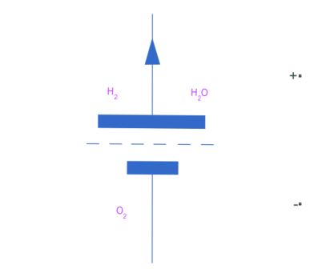
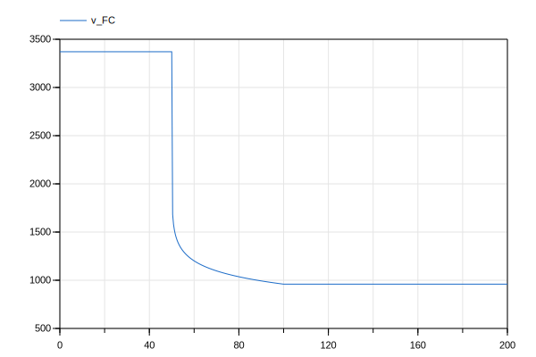

## Model A
# Fuel Cell Simplified Electrical Model
This repository contains a Modelica-based Fuel Cell model that replicates the Simscape Fuel Cell Simplified Electrical Model which can be found here: https://www.mathworks.com/help/sps/ref/fuelcell.html. 

The model is designed to be functionally equivalent to the Simscape version, This repository includes simulation results showcasing the fuel cell's voltage and power output in both Simulink and Dymola, demonstrating the consistency and accuracy of the Modelica implementation.

