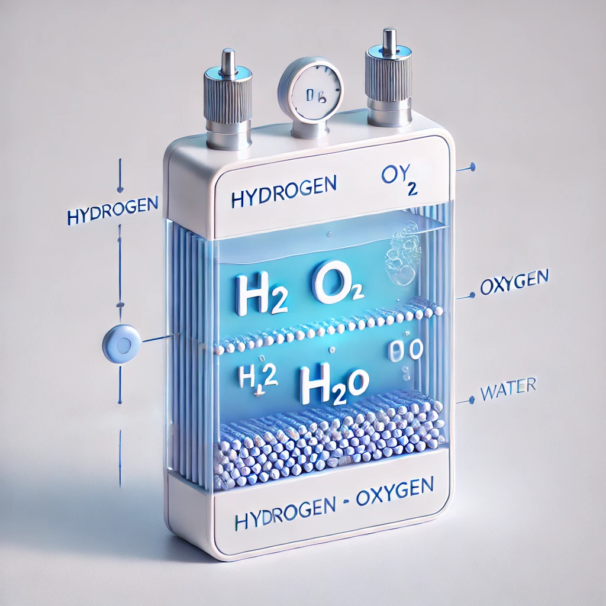
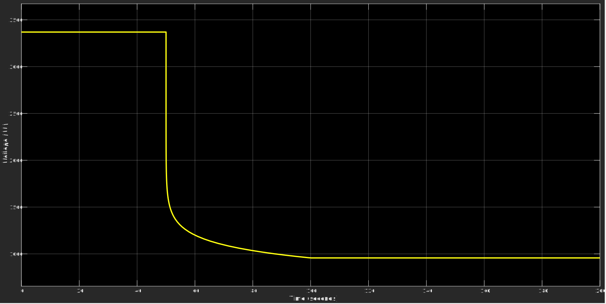
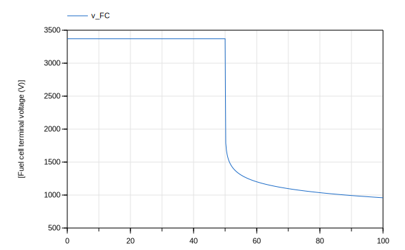
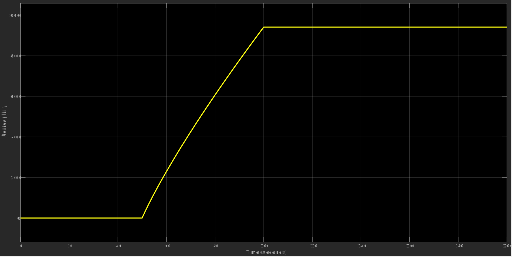
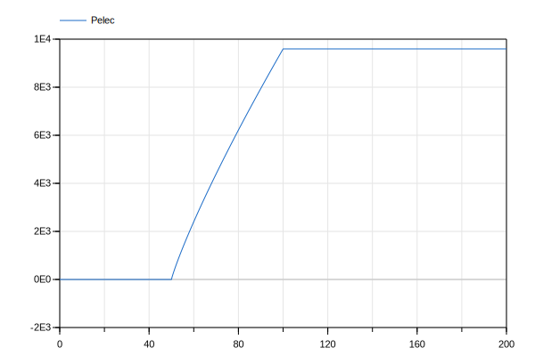

## Model A
# Fuel Cell Simplified Electrical Model
This repository contains a Modelica-based Fuel Cell model that replicates the Simscape Fuel Cell Simplified Electrical Model which can be found [here](https://www.mathworks.com/help/sps/ref/fuelcell.html). The model can also be found in the BFCEA library (as BFCEA.simpleFC).

  

    
    
<strong>Simulink</strong> - Voltage output of the Fuel Cell model in Simulink.

  

  

    
    
<strong>Dymola</strong> - Voltage output of the Fuel Cell model in Dymola.

  

The model is designed to be functionally equivalent to the Simscape version model. This repository includes simulation results showcasing the fuel cell's voltage and power output in both Simulink and Dymola, demonstrating the consistency and accuracy of the Modelica implementation.

### Voltage Output Comparison

  

    
    
<strong>Simulink</strong> - Voltage output of the Fuel Cell model in Simulink.

  

  

    
    
<strong>Dymola</strong> - Voltage output of the Fuel Cell model in Dymola.

  

### Power Output Comparison

  

    
    
<strong>Simulink</strong> - Power output of the Fuel Cell model in Simulink.

  

  

    
    
<strong>Dymola</strong> - Power output of the Fuel Cell model in Dymola.

  

