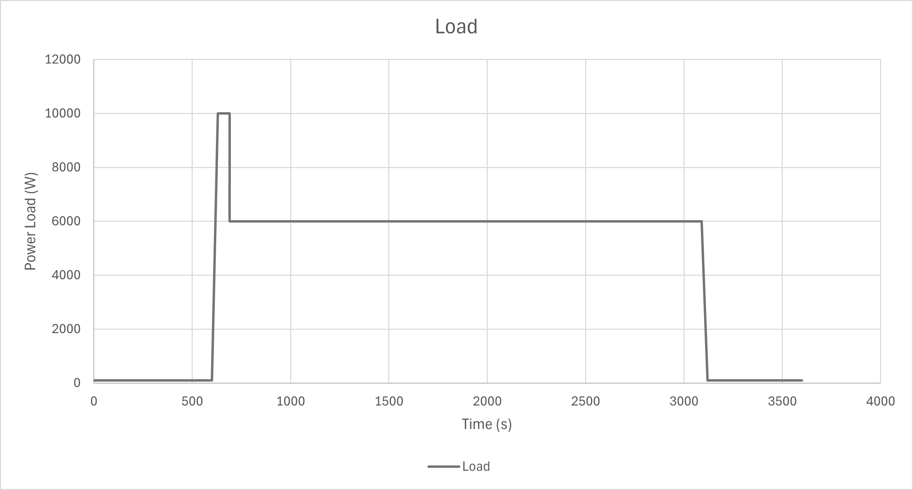
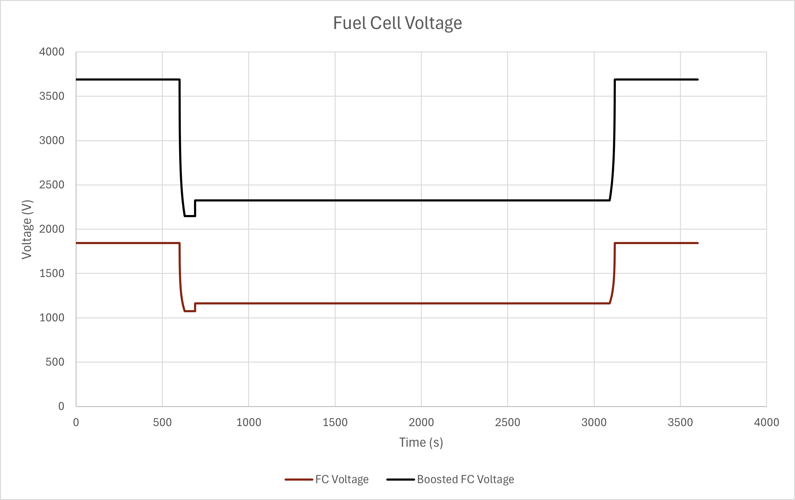
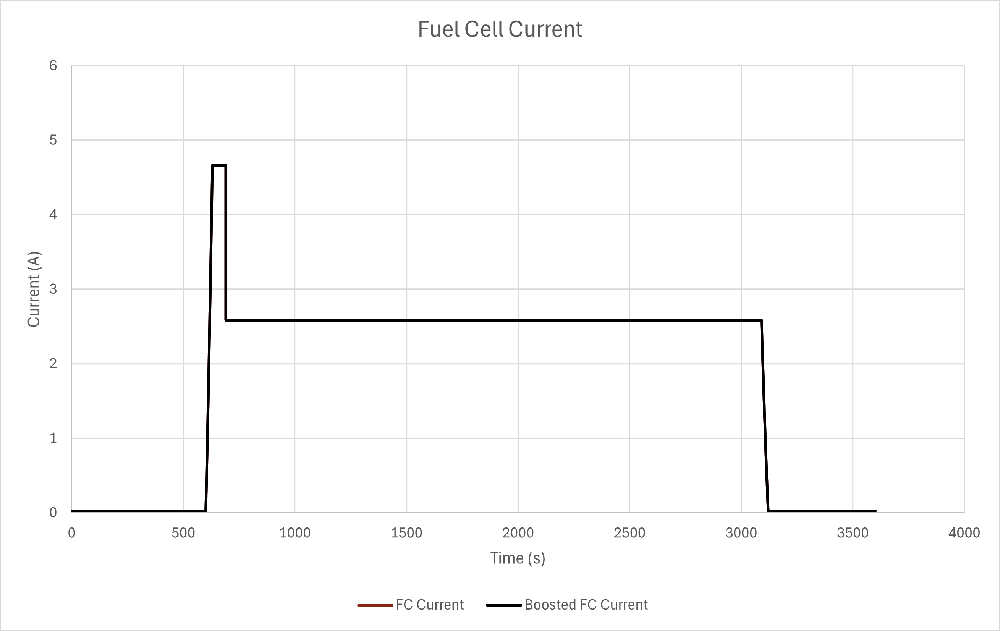

# Model B

Fuel cell from Model A with DC/DC booster and inverter.

Requires usage of the following third-party library/libraries: --PowerSystems https://github.com/modelica-3rdparty/PowerSystems

The model consists of the simple fuel cell model of Model A, represented as the fc block and a supply voltage (voltage1) connected in series to a DC/DC booster (fcBooster), a bus, and a three-phase inverter (inverter).  pQsource1 provides a load on the system roughly approximating the flight cylce of an aircraft: 10 minutes of airstrip taxiing, a steep 30-second ramp to peak power for takeoff, approximately 40 minutes at reduced power for flight, a ramp down for landing, and 10 minutes of taxiing after landing.

Approximate power cycle of a typical aircraft.  All values are nominal.

Note the peaks and valleys corresponding to the power cycle; note also that the boosted voltage is exactly twice the unboosted.

Note the peaks and valleys corresponding to the power cycle; note also that both the boosted and unboosted currents are the same.
